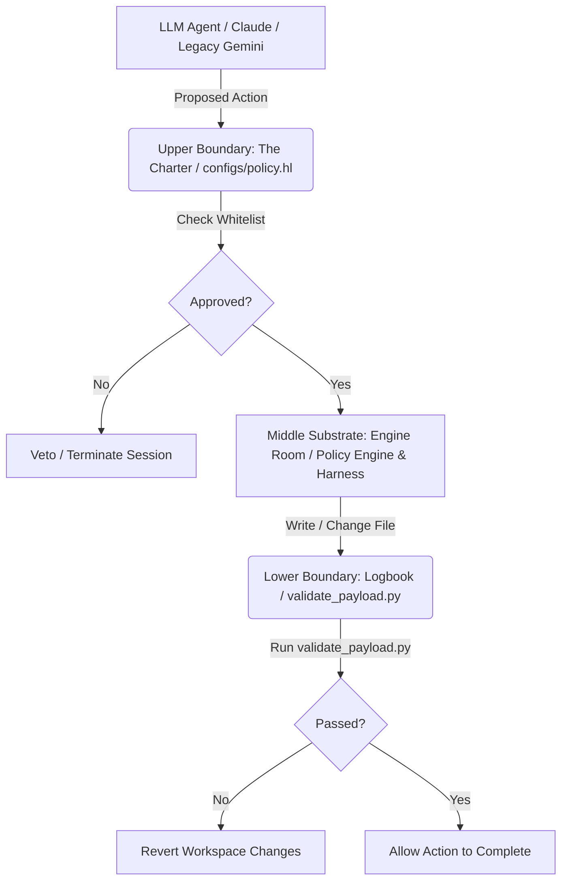

# Specification: Bulkhead &tau; Policy Gate & Interception Harness

A design blueprint for building a **declarative policy-driven pre-execution gate and verification harness** for LLM agents. This system intercepts proposed tool actions (such as terminal commands, file reads/writes, or model calls), verifies them against a declarative Hyperlambda policy tree, and runs deterministic post-validation checks to protect the workspace.

---

## 💡 Lessons Learned & Architectural Inversion

This specification addresses a key failure mode encountered in previous attempts to let generative AI write executable backend code.

### The Previous Failure: Model Hallucination
In a prior attempt to integrate AI-generated code directly with the Magic backend, the LLM hallucinated code components—specifically generating a non-existent `ollama-interceptor.hl` file and using invalid parameters (like `input_tokens` junk) that triggered 500 server errors in the AI module. 

### The Key Lesson (The Polterguy Inversion):
This incident highlighted the danger of letting a stochastic model grade its own homework or write its own execution paths without an independent, deterministic witness. 

The core thesis of this harness is a direct **inversion** of Thomas Hansen's (Polterguy's) Hyperlambda philosophy:
*   **Hansen / Magic View:** The Hyperlambda tree is the **OUTPUT** of AI generation (AI writes the system's code).
*   **Bulkhead Tau View:** The Hyperlambda tree is a **STATIC GOVERNANCE SPEC** (the bulkhead). Executing it does not build the system; rather, **execution is the evidence** (the trace) that checks the model's output. 

By running the lambda-tree "backwards" as a static check rather than a dynamic output, we enforce determinism as the witness against the model.

---

## 📐 Conceptual Architecture: The High-Integrity Sandwich

The harness enforces a triple-boundary governance model directly aligned with the **Bulkhead &tau;** architecture:



1. **Upper Boundary (The Charter - `configs/policy.hl`):** A static, declarative Hyperlambda tree defining the bounds of authorized behavior. It references the Alignment PBC guidelines (`docs/behaviors/alignment.pbc.md`).
2. **Middle Substrate (The Engine Room):** The active interpreter that executes tools and queries databases. It bridges the **OpenClaw** gateway services (`127.0.0.1:19001`) and the domain-doctor Python slots (e.g. `imu.peak_audit`).
3. **Lower Boundary (The Logbook/Witness):** A post-execution validation engine that runs deterministic tests (`validate_payload.py`) to confirm physical correctness after changes.

---

## 📝 1. The Policy Schema (`configs/policy.hl`)

Policies are declared as nested Hyperlambda trees. This format is easily read and written by LLMs (acting as policy generators) while remaining strictly parsed by the runtime.

```hyperlambda
/* 
   Execution Policy for project-phoenix
   File: configs/policy.hl
 */

// Whitelist of allowed tool calls
.allowed_tools
   .:run_command
   .:write_file
   .:replace
   .:write_to_file
   .:pytest
   .:git
   .:read_file

// Prefix rules for command execution (incorporating OpenClaw and Web Arm deployments)
.command_permissions
   allow
      .:"git status"
      .:"git log"
      .:"git diff"
      .:"pytest"
      .:"uv run pytest"
   deny
      .:"rm -rf"
      .:"sudo"
      .:"curl"

// Whitelist of directories allowed to be modified
.write_permissions
   allow_paths
      .:"signals/"
      .:"configs/"
      .:"tests/"
      .:"pyproject.toml"
      .:"requirements.txt"
      .:"README.md"
   deny_paths
      .:"magic/plugins/"
      .:".git/"

// Required validation loops after any edit
.post_write_validators
   -:"validate_payload.py"
```

---

## ⚙️ 2. Pre-Execution Interception & PreToolUse Hooks

Before the agent fires a tool call, the proposed action is converted into a Hyperlambda execution node and evaluated against the policy.

The primary, durable path for this is the Claude Code **PreToolUse** hook (`claude_hook.py` and `pre_tool_hook.py`).

### Intercepted Action Payload:
```json
{
  "tool_name": "Bash",
  "tool_input": {
    "command": "git status"
  }
}
```

### Policy Verification Logic:
1. **Tool Verification:** Ensure the requested tool (e.g., `Bash`, `Write`, `Edit`, `Read`) maps to an allowed category.
2. **Command Verification:** If a shell command is proposed, the policy engine matches it against whitelisted prefixes.
3. **Path Verification:** If a file write or edit is proposed, the target path is checked against the allowed write directories (e.g., preventing modification of `.git/` configurations).
4. **Predictive Validation:** For write/edit tools, the hook simulates the modification in memory (or a temp file) and runs `validate_payload.py` to ensure correctness *before* writing the final changes to the workspace.

---

## 🛡️ 3. Post-Execution Validation Loop

If an action passes the pre-execution policy and modifies files, the **Lower Boundary** is triggered before the action is marked as complete. This ensures the workspace does not decay.

If the validation fails:
1. The harness catches the failure and logs the error.
2. Any temporary backups are restored to revert the workspace to a clean state.
3. The proposed write is blocked, keeping the codebase protected.

---

## 📅 4. Legacy Compatibility

A legacy harness class `GeminiHarness` is preserved under `harness.py`. This implementation is sunsetting in favor of the active Claude hooks and generic agentic interfaces, but remains fully tested and functional for backward compatibility.
